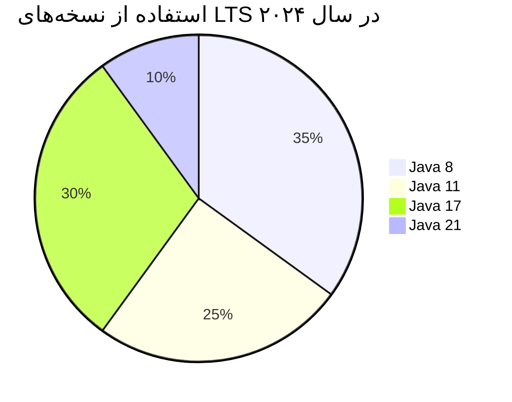

java 17 samples

### نسخه‌های LTS جاوا (Long-Term Support)

نسخه‌های LTS (پشتیبانی بلندمدت) جاوا توسط اوراکل و سایر ارائه‌دهندگان (مانند OpenJDK) پشتیبانی می‌شوند و برای محیط‌های سازمانی که نیاز به ثبات دارند توصیه می‌شوند. در ادامه لیست نسخه‌های LTS و جزئیات مهم هرکدام را مشاهده می‌کنید:

---

#### **لیست نسخه‌های LTS جاوا** (تا سال ۲۰۲۴)
| نسخه | تاریخ انتشار | پایان پشتیبانی رایگان (اوراکل) | جایگزین‌های مدرن |
|-------|--------------|----------------------------------|------------------|
| **Java 8 (LTS)** | مارس ۲۰۱۴ | دسامبر ۲۰۳۰ (اوراکل) | آخرین نسخه با پشتیبانی بسیار طولانی |
| **Java 11 (LTS)** | سپتامبر ۲۰۱۸ | سپتامبر ۲۰۲۶ (اوراکل) | اولین نسخه LTS با مدل اشتراکی اوراکل |
| **Java 17 (LTS)** | سپتامبر ۲۰۲۱ | حداقل تا ۲۰۲۹ | پایدارترین نسخه فعلی برای پروژه‌های جدید |
| **Java 21 (LTS)** | سپتامبر ۲۰۲۳ | حداقل تا ۲۰۳۱ | جدیدترین نسخه LTS با ویژگی‌های پیشرفته |

---

### **مقایسه نسخه‌های LTS**

#### **۱. Java 8 (LTS)**
- **مهم‌ترین تغییرات**: لامبدا، استریم‌ها، متدهای پیشفرض در اینترفیس‌ها
- **وضعیت کنونی**: هنوز پراستفاده‌ترین نسخه در پروژه‌های قدیمی
- **نکته**: اوراکل تا **۲۰۳۰** به صورت رایگان برای کاربران شخصی پشتیبانی می‌کند.

#### **۲. Java 11 (LTS)**
- **مهم‌ترین تغییرات** (نسبت به ۸):
    - `var` برای متغیرهای محلی
    - `HttpClient` جدید
    - حذف Java EE و CORBA
- **مدل انتشار**: اولین نسخه پس از تغییر به انتشار هر ۶ ماهه

#### **۳. Java 17 (LTS)**
- **مهم‌ترین تغییرات** (نسبت به ۱۱):
    - رکوردها (Records)
    - سیلد کلاس‌ها (Sealed Classes)
    - متن‌های چندخطی (Text Blocks)
    - سوئیچ پیشرفته (Pattern Matching)
- **توصیه**: بهترین انتخاب برای پروژه‌های جدید در سال ۲۰۲۴

#### **۴. Java 21 (LTS)**
- **مهم‌ترین تغییرات** (نسبت به ۱۷):
    - Virtual Threads (پروژه لوم)
    - پترن ماچینگ کامل برای سوئیچ
    - بهبود APIهای Memory
- **ویژگی**: بهترین عملکرد و جدیدترین قابلیت‌ها

---

### **پشتیبانی نسخه‌ها**
| ارائه‌دهنده | Java 8 | Java 11 | Java 17 | Java 21 |
|-------------|--------|---------|---------|---------|
| **Oracle JDK** | ✅ (تا ۲۰۳۰) | ✅ (با پرداخت) | ✅ (رایگان برای توسعه) | ✅ (LTS جدید) |
| **OpenJDK** | ✅ (Adoptium) | ✅ | ✅ | ✅ |
| **Amazon Corretto** | ✅ | ✅ | ✅ | ✅ |
| **Azul Zulu** | ✅ | ✅ | ✅ | ✅ |

---

### **کدام نسخه را انتخاب کنیم؟**
- **پروژه‌های قدیمی**: Java 8 یا ۱۱ (اگر امکان ارتقا نیست)
- **پروژه‌های جدید سازمانی**: Java 17 (پایدار + پشتیبانی بلندمدت)
- **پروژه‌های پیشرفته**: Java 21 (جدیدترین ویژگی‌ها)

---

### **نکات فنی مهم**
1. **تفاوت Oracle JDK و OpenJDK**:
    - از جاوا ۱۱ به بعد، Oracle JDK برای استفاده تولیدی نیاز به **لایسنس پرداختی** دارد.
    - OpenJDK (مثل Temurin، Corretto) کاملاً **رایگان** است.

2. **مدل انتشار جدید**:
    - هر ۶ ماه یک نسخه غیر-LTS منتشر می‌شود.
    - هر **۲ سال** یک نسخه LTS منتشر می‌شود (۸ → ۱۱ → ۱۷ → ۲۱ → ...).

3. **مهاجرت بین نسخه‌ها**:
    - از ۸ به ۱۱: نیاز به بررسی ماژول‌های حذف شده (مثل Java EE)
    - از ۱۱ به ۱۷: تغییرات کمتر، سازگاری بهتر

---

### **جمع‌بندی**

- **Java 17** در حال حاضر **بهترین تعادل** بین پایداری و ویژگی‌های مدرن را ارائه می‌دهد.
- **Java 21** برای پروژه‌های پیشرفته که از Virtual Threads استفاده می‌کنند ایده‌آل است.
- سازمان‌ها باید برنامه‌ریزی برای مهاجرت از ۸/۱۱ به ۱۷/۲۱ داشته باشند.

 